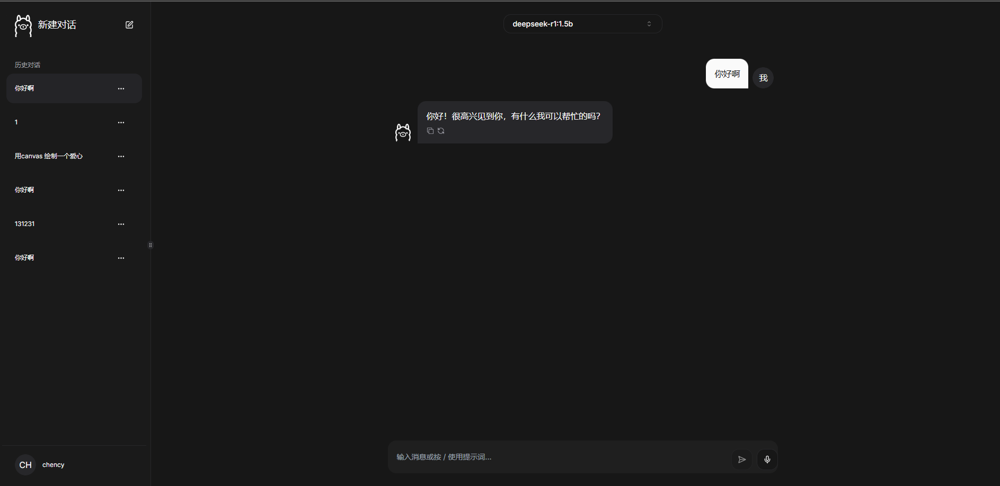

<div align="center">
  
  
  <h1>Ollama Chat - 优雅的本地 LLM 聊天界面</h1>

  <p>
    <a href="https://github.com/chency7/ollama-chat/stargazers">
      
    </a>
    <a href="https://github.com/chency7/ollama-chat/network/members">
      
    </a>
    <a href="https://github.com/chency7/ollama-chat/issues">
      
    </a>
    <a href="https://github.com/chency7/ollama-chat/blob/main/LICENSE">
      
    </a>
  </p>

  <p>🚀 <strong>快速</strong> · 🏠 <strong>本地化</strong> · 🔒 <strong>离线运行</strong></p>
  
  <p>为本地大语言模型打造的现代化 Web 界面，让 AI 对话变得简单自然。</p>
</div>

## ✨ 特性亮点

- 🎨 **优雅的用户界面** - 灵感来自 ChatGPT，提供流畅直观的对话体验
- 💾 **完全本地化** - 聊天记录存储在本地，无需数据库
- 📱 **响应式设计** - 完美适配从手机到桌面的各种设备
- 🚀 **简单部署** - 几分钟内即可完成安装，开始 AI 对话
- 🎯 **核心功能**
  - 代码语法高亮与一键复制
  - 模型管理（下载/删除/切换）
  - 聊天历史记录保存
  - 明暗主题切换
  - 语音输入支持
  - 图片识别能力
  - 对话重新生成

## 🎥 功能演示

<div align="center">
  <video src="https://github.com/jakobhoeg/nextjs-ollama-llm-ui/assets/114422072/08eaed4f-9deb-4e1b-b87a-ba17d81b9a02" />
</div>

## ⚡️ 快速开始

### 系统要求

- [Ollama](https://ollama.com/download) - 本地运行 LLM 的核心引擎
- [Node.js](https://nodejs.org/) 18+ 和 npm

### Docker 部署

```bash
# Ollama 运行在同一台机器上
docker run -d -p 8080:3000 \
  --add-host=host.docker.internal:host-gateway \
  -e OLLAMA_URL=http://host.docker.internal:11434 \
  --name nextjs-ollama-ui \
  --restart always \
  jakobhoeg/nextjs-ollama-ui:latest

# Ollama 运行在远程服务器上
docker run -d -p 8080:3000 \
  -e OLLAMA_URL=http://example.com:11434 \
  --name nextjs-ollama-ui \
  --restart always \
  jakobhoeg/nextjs-ollama-ui:latest
```

### 本地开发环境搭建

```bash
# 克隆项目
git clone https://github.com/jakobhoeg/nextjs-ollama-llm-ui

# 进入项目目录
cd nextjs-ollama-llm-ui

# 配置环境变量
cp .example.env .env

# 安装依赖
npm install

# 启动开发服务器
npm run dev
```

访问 [http://localhost:3000](http://localhost:3000) 开始体验！

## 🛠 技术栈

- [Next.js](https://nextjs.org/) - React 应用框架
- [TailwindCSS](https://tailwindcss.com/) - 原子化 CSS 框架
- [shadcn/ui](https://ui.shadcn.com/) - 精美的 UI 组件库
- [Framer Motion](https://www.framer.com/motion/) - 动画效果库
- [Lucide Icons](https://lucide.dev/) - 图标系统

## 🗺 开发路线图

- ✅ 语音输入支持
- ✅ 代码语法高亮
- ✅ 图片识别能力
- ✅ 对话重新生成
- ⬜️ 导入/导出聊天记录
- ⬜️ 更多期待...

## 📝 致谢

本项目基于 [nextjs-ollama-llm-ui](https://github.com/jakobhoeg/nextjs-ollama-llm-ui) 进行优化开发，主要改进：

- 完整的中文本地化
- 优化移动端适配
- 改进主题切换体验
- 优化图片显示效果
- 修复已知问题

特别感谢 [@jakobhoeg](https://github.com/jakobhoeg) 的开源贡献！

## 📄 开源协议

本项目采用 [MIT](LICENSE) 协议开源。
